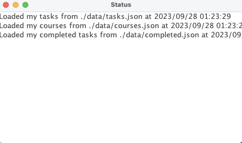

# ToDo: CPSC 210 Final Project

## Proposal

A personalized **agenda application** designed to help keep students on track with their courses
and create personalized to-do lists. This application is intended for all UBC students and especially those who need extra
assistance in managing their time and meeting deadlines. With the move to online learning, many courses use various
platforms to deliver course content. With this application, you will now be able to manage your tasks for all your 
courses in one spot.

<pre>
*Features*:

- A list of your currently enrolled classes
- A personalized todo list with due dates
- Individual course tabs with tasks specific to the course
 </pre>

## Language/Library/IDE

<b>Language:</b>  Java  
<b>Library</b>: Java Swing  
<b>IDE</b>: IntelliJ IDEA

Skills learned:

- Using the Java Swing library to construct a working GUI utilizing different UI components
- Applying Object-Oriented Programming and polymorphism in software design
- Utilization of JUnit testing to create unit tests and assess code coverage to ensure reliability
    - Use tests to identify bugs in the program and efficiently debug
    - Refactor after testing to improve readability and maintainability
- Using the JSON API to save and load data

## Demo

https://github.com/sparky713/ToDo/assets/89681080/83edf493-2a5c-4c8a-93a6-a2e4188e8a57

#### Main Page:

#### Courses Page:

#### Tasks Page:

#### Completed Tasks Page:

#### Load and Save Log:

